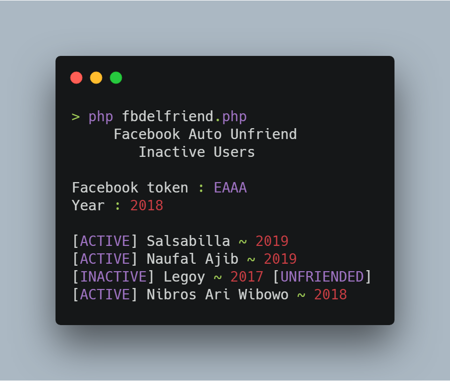

# NewFacebookUnfriend
Unfriend inactive users

New method of [My old repo](https://github.com/dandyraka/FacebookUnfriend)

## NEW Method
`My old repo is still works, but if you have Access Token that support unfriend request.
It's hard to find that now.
So i made this repo, maybe a little complicated. But it works to delete friend.`

Open **TUTORIAL.html** for more detail.

- Get token :
    - [Here](http://tiny.cc/kx04mz) or
    - [Here](http://tiny.cc/ob74mz)

Good luck.

## Install
      $ pkg install php
      $ git clone https://github.com/dandyraka/NewFacebookUnfriend.git
      $ cd NewFacebookUnfriend

## Run
      $ php unfriend.php

## Updating
      $ git pull --force

## Explanation :
- Input :
    - Facebook token `your facebook token (EAAAAA...)`
    - Year `Ex : 2018, unfriend users where doesn't update status before 2018`

